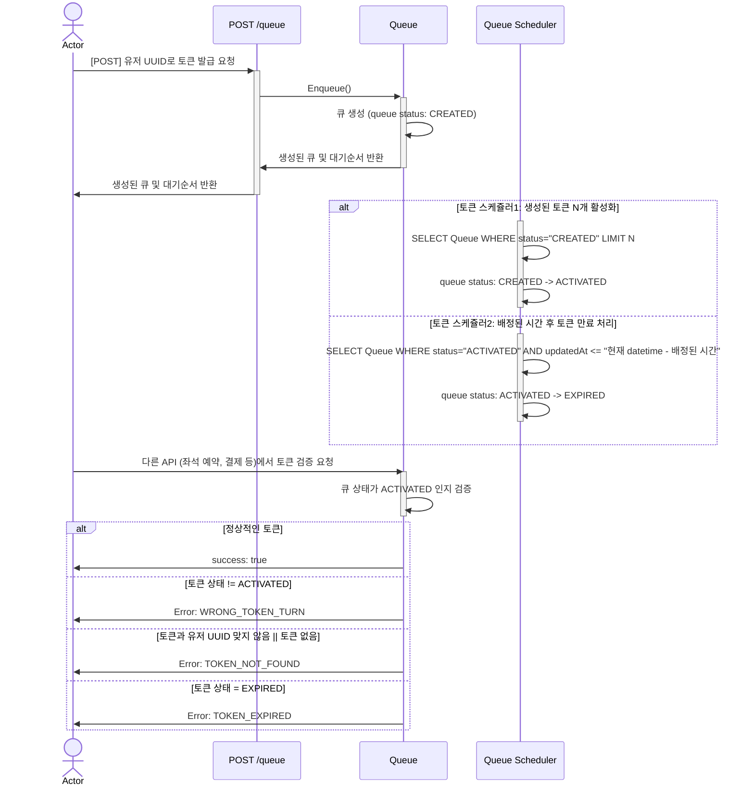
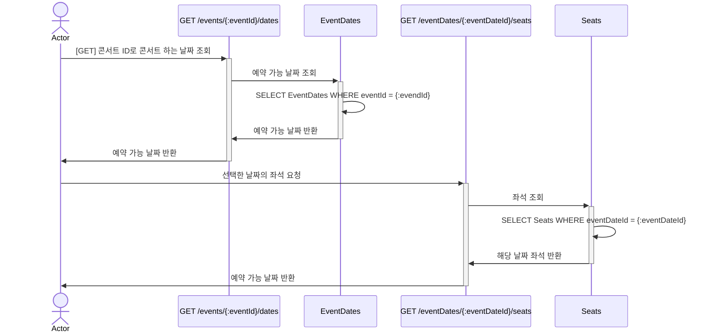
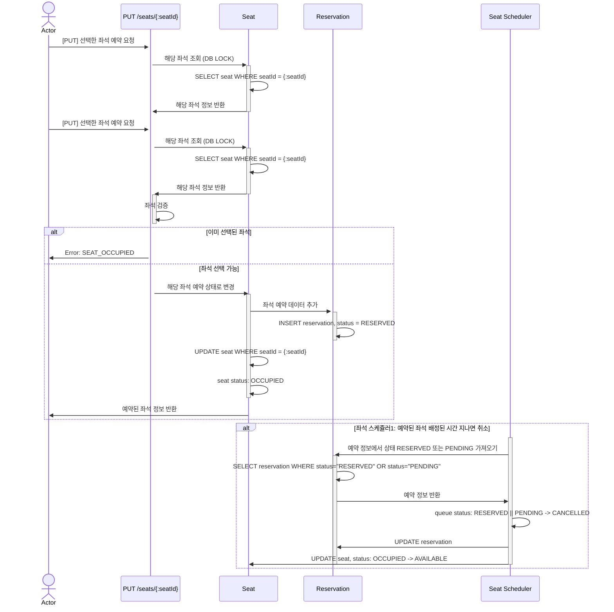
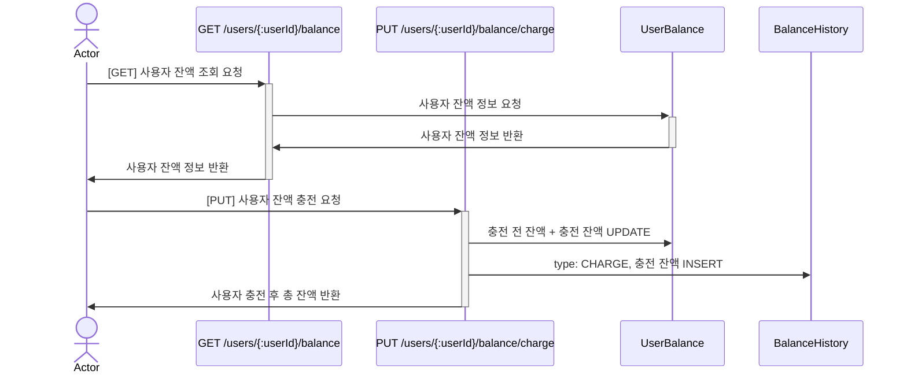
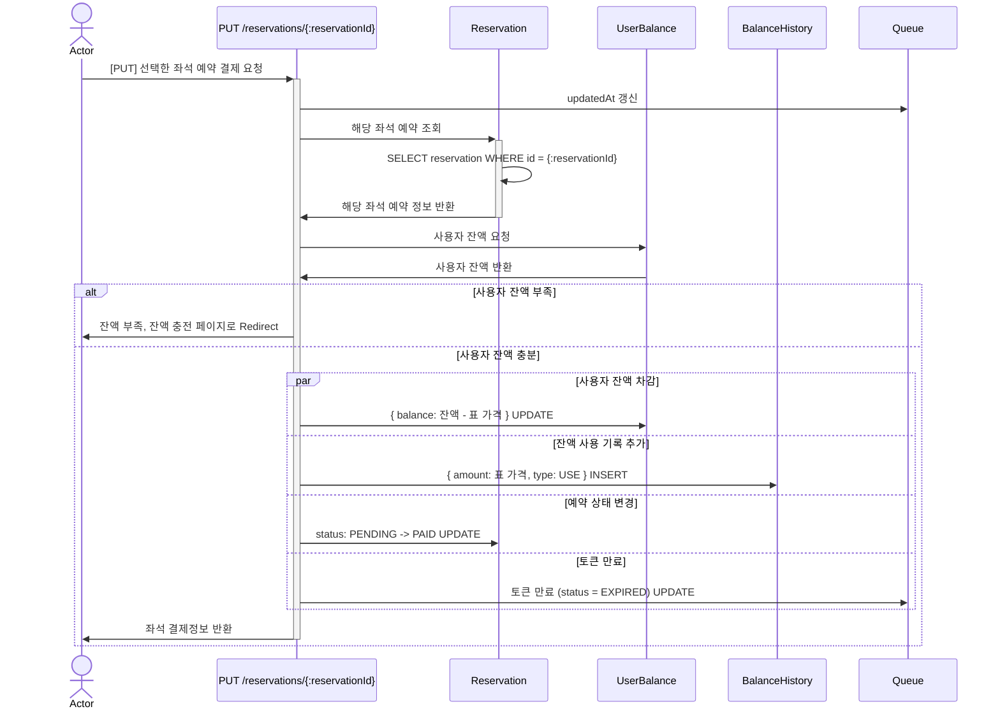

# 항해플러스 Chapter 2

## 목차

- [SWAGGER 문서](#swagger-문서)
- [시나리오 요구사항 분석](#시나리오-요구사항-분석)
- [ERD 설계](#erd-설계)
- [API 명세서](#api-명세서)
- [동시성 제어](#동시성-제어)
- [Query 분석 및 캐싱 전략 설계](#query-분석-및-캐싱-전략-설계)

## SWAGGER 문서


## 시나리오 요구사항 분석

### **유저 대기열 토큰 기능**

---

- 서비스를 이용할 토큰을 발급받는 API를 작성합니다.
- 토큰은 유저의 UUID 와 해당 유저의 대기열을 관리할 수 있는 정보 ( 대기 순서 or 잔여 시간 등 ) 를 포함합니다.
- 이후 모든 API 는 위 토큰을 이용해 대기열 검증을 통과해야 이용 가능합니다.



### **예약 가능 날짜 / 좌석 API**

---

- 예약가능한 날짜와 해당 날짜의 좌석을 조회하는 API 를 각각 작성합니다.
- 예약 가능한 날짜 목록을 조회할 수 있습니다.
- 날짜 정보를 입력받아 예약가능한 좌석정보를 조회할 수 있습니다.
  > 좌석 정보는 1 ~ 50 까지의 좌석번호로 관리됩니다.



### **좌석 예약 요청 API**

---

- 날짜와 좌석 정보를 입력받아 좌석을 예약 처리하는 API 를 작성합니다.
- 좌석 예약과 동시에 해당 좌석은 그 유저에게 약 (예시 : 5분)간 임시 배정됩니다. ( 시간은 정책에 따라 자율적으로 정의합니다. )
- 만약 배정 시간 내에 결제가 완료되지 않는다면 좌석에 대한 임시 배정은 해제되어야 하며 만약 임시배정된 상태라면 다른 사용자는 예약할 수 없어야 한다.



### **잔액 충전 / 조회 API**

---

- 결제에 사용될 금액을 API 를 통해 충전하는 API 를 작성합니다.
- 사용자 식별자 및 충전할 금액을 받아 잔액을 충전합니다.
- 사용자 식별자를 통해 해당 사용자의 잔액을 조회합니다.



### **결제 API**

---

- 결제 처리하고 결제 내역을 생성하는 API 를 작성합니다.
- 결제가 완료되면 해당 좌석의 소유권을 유저에게 배정하고 대기열 토큰을 만료시킵니다.



---

## ERD 설계

| 테이블          | 용도                 | 설명                     |
| --------------- | -------------------- | ------------------------ |
| Event           | 공연                 | 기초 정보 (이름, 출연자) |
| Event Property  | 공연 속성            | 세부 정보                |
| Queue           | 대기열               |
| Seat            | 좌석                 | 특정 공연 날짜 좌석 정보 |
| Seat Property   | 좌석 속성            | 좌석 이름, 가격          |
| Reservation     | 예약                 | 좌석 예약 정보           |
| Payment         | 결제                 | 예약한 좌석 결제 정보    |
| User Balance    | 사용자 잔액          |
| Balance History | 잔액 충전, 사용 기록 |


## API 명세서

---

### API 목록

- [유저 대기열 토큰](#유저-대기열-토큰-api)
- [예약 가능 날짜 조회 API](#예약-가능-날짜-조회-api)
- [예약 가능 좌석 조회 API](#예약-가능-좌석-api)
- [좌석 예약 요청 API](#좌석-예약-요청-api)
- [잔액 조회 API](#잔액-조회-api)
- [잔액 충전 API](#잔액-충전-api)
- [결제 API](#결제-api)

---

### 유저 대기열 토큰 API

`POST /queue`

#### Request Body

| 이름   | 타입 | 내용      |
| ------ | ---- | --------- |
| userId | uuid | 사용자 ID |

```
- request body
{
  userId: 550e8400-e29b-41d4-a716-446655440000
}
```

#### Response Body

| 이름    | 타입    | 내용        |
| ------- | ------- | ----------- |
| eventId | integer | 콘서트의 ID |
| token   | string  | Bearer 토큰 |

```
- response
{
  success: true,
  data: {
   eventId: 1,
   token: Bearer ${token_value}
  }
}
```

---

### 예약 가능 날짜 조회 API

`GET /events/{:eventId}/dates`

#### Parameters

| 이름    | 타입          | 내용        |
| ------- | ------------- | ----------- |
| eventId | number string | 콘서트의 id |

#### Response Body

| 이름          | 타입    | 내용                |
| ------------- | ------- | ------------------- |
| eventId       | integer | 이벤트 ID           |
| eventDate     | date    | 공연 시작 날짜+시간 |
| bookStartDate | date    | 예약 가능 시작 날짜 |
| bookEndDate   | date    | 예약 종료 날짜      |
| seatCount     | integer | 잔여 좌석 갯수      |
| createdAt     | date    |                     |
| updatedAt     | date    |                     |
| deletedAt     | date    |                     |

```
- response
{
  success: true,
  data:  [
      {
        id: 1,
        eventId: 1,
        startDate: 2024-07-03 09:00:00
        seatCount: 50,
        createdAt:
        updatedAt:
        deletedAt:
      }, {...}
    ]
}
```

---

### 예약 가능 좌석 조회 API

`GET /events/properties/{:propertyId}/seats`

#### Parameters

| 이름       | 타입          | 내용                  |
| ---------- | ------------- | --------------------- |
| propertyId | number string | 콘서트 특정 날짜의 ID |

#### Response Body

| 이름                 | 타입                      | 내용                               |
| -------------------- | ------------------------- | ---------------------------------- |
| seatNumber           | integer                   | 좌석 번호                          |
| status               | "AVAILABLE" \| "OCCUPIED" | 예약 가능 \| 예약 또는 결제된 상태 |
| eventDateId          | integer                   | 콘서트 날짜 ID                     |
| seatProperty{}.id    | integer                   | 좌석 속성 ID                       |
| seatProperty{}.name  | string                    | 좌석 이름                          |
| seatProperty{}.price | integer                   | 좌석 가격                          |

```
- response
{
  success: true,
  data: {
   seat: [
      {
        id: 1,
        seatNumber: 1,
        status: available,
        eventDateId: 1,
        seatProperty: {
          id: 1,
          name: 스탠딩,
          price: 100000
        }
      }, {...}
    ]
  }
}
```

---

### 좌석 예약 요청 API

`POST /events/seats`

#### Request Body

| 이름   | 타입          | 내용             |
| ------ | ------------- | ---------------- |
| seatId | number string | 콘서트 좌석의 ID |
| userId | uuid          | 사용자 ID        |

```
- request body
{
  seatId: 1,
  userId: 550e8400-e29b-41d4-a716-446655440000
}
```

#### Response Body

| 이름            | 타입                                                           | 내용                  |
| --------------- | -------------------------------------------------------------- | --------------------- |
| seatId          | integer                                                        | 좌석 ID               |
| userId          | string                                                         | 사용자 ID             |
| status          | "RESERVED" \| "PENDING" \| "PAID" \| "CANCELLED" \| "REFUNDED" | 예약 상태             |
| eventId         | number                                                         | 공연 ID               |
| eventName       | integer                                                        | 공연 이름             |
| eventPropertyId | integer                                                        | 공연 속성 ID          |
| eventDate       | date                                                           | 공연 시작 날짜 + 시간 |
| price           | integer                                                        | 표 가격               |

```
- response
{
  success: true,
  data: {
    id: 1,
    seatId: 1,
    userId: ffd7a6d2-b742-4b7c-b7e4-a5e435435288,
    status: RESERVED,
    createdAt: 2024-07-03 14:34:19.282,
    updatedAt: 2024-07-03 14:34:19.282,
    deletedAt: 2024-07-03 14:34:19.282,
    eventId: 1,
    eventName: 공연 이름,
    eventPropertyId: 1,
    eventDate: 2024-07-03 14:34:19.282,
    price: 50000
  }
}
```

---

### 잔액 조회 API

`GET /users/{:userId}/balance`

#### Parameters

| 이름   | 타입 | 내용      |
| ------ | ---- | --------- |
| userId | uuid | 사용자 ID |

#### Response Body

| 이름    | 타입    | 내용                   |
| ------- | ------- | ---------------------- |
| id      | integer | User Balance 테이블 ID |
| userId  | string  | 사용자 ID              |
| balance | number  | 잔액 량                |

```
- response
{
  success: true,
  data: {
    id: 1,
    userId: ffd7a6d2-b742-4b7c-b7e4-a5e435435288,
    balance: 100000,
  }
}
```

---

### 잔액 충전 API

`PUT /users/{:userId}/balance/charge`

#### Parameters

| 이름   | 타입 | 내용      |
| ------ | ---- | --------- |
| userId | uuid | 사용자 ID |

#### Request Body

| 이름   | 타입    | 내용             |
| ------ | ------- | ---------------- |
| amount | integer | 충전 하려는 금액 |

```
- request body
{
  amount: 50000
}
```

#### Response Body

| 이름   | 타입                          | 내용                                     |
| ------ | ----------------------------- | ---------------------------------------- |
| id     | integer                       | Balance History 테이블 ID                |
| userId | string                        | 사용자 ID                                |
| type   | "CHARGE" \| "USE" \| "REFUND" | 충전 = CHARGE, 결제 = USE, 환불 = REFUND |
| amount | integer                       | 충전 된 금액                             |

```
- response
{
  success: true,
  data: {
      id: 1,
      userId: ffd7a6d2-b742-4b7c-b7e4-a5e435435288,
      type: CHARGE,
      amount: 50000
  }
}
```

---

### 결제 API

`PUT /events/reservations/{:reservationId}/pay`

#### Parameters

| 이름          | 타입 | 내용      |
| ------------- | ---- | --------- |
| reservationId | uuid | 사용자 ID |

#### Response Body

| 이름           | 타입                                                           | 내용                    |
| -------------- | -------------------------------------------------------------- | ----------------------- |
| id             | integer                                                        | Reservation 테이블 ID   |
| seatId         | integer                                                        | Seat 테이블 ID          |
| userId         | string                                                         | 사용자 ID               |
| status         | "RESERVED" \| "PENDING" \| "PAID" \| "CANCELLED" \| "REFUNDED" | 예약 상태               |
| eventId        | integer                                                        | 콘서트 ID               |
| eventName      | string                                                         | 콘서트 이름             |
| eventDateId    | integer                                                        | 콘서트 날짜 ID          |
| eventStartDate | datetime                                                       | 콘서트 시작 날짜 + 시간 |
| price          | integer                                                        | 표 가격                 |

```
- response
{
  success: true,
  data: {
      id: 1,
      seatId: 1,
      userId: ffd7a6d2-b742-4b7c-b7e4-a5e435435288,
      status: PAID,
      createdAt: 2024-07-03 14:34:19.282,
      updatedAt:2024-07-03 14:34:19.282,
      deletedAt: null,
      eventId: 1,
      eventName: 콘서트 이름,
      eventDateId: 1,
      eventStartDate: 2024-07-03 14:34:19.282,
      price: 50000
  }
}
```

---

### 동시성 제어

#### 데이터베이스 LOCK

- 장점:

  - ACID 지원: 트랜잭션의 원자성, 일관성, 고립성, 지속성을 보장하여 데이터 무결성을 유지.
  - 편리성: 이미 존재하는 데이터베이스 기능을 활용하기 때문에 별도의 인프라 설정이 필요 없음.
  - 강력한 일관성: 데이터베이스 레벨에서의 잠금이므로 강력한 일관성을 제공.

- 단점:
  - 성능 저하: 락 경합이 발생하면 성능이 저하될 수 있음. 특히 대량의 트랜잭션이 발생할 경우 병목 현상이 발생할 수 있다.
  - 확장성 한계: 단일 데이터베이스 인스턴스에서의 락 관리는 분산 시스템에서 확장성이 제한적.
  - 복잡성: 복잡한 쿼리와 트랜잭션을 관리해야 하며, 락 관련 이슈(예: 데드락)를 해결해야 함.

#### Redis를 활용한 분산 LOCK

- 장점:
  - 고성능: Redis는 메모리 기반 데이터 저장소이기 때문에 락 획득과 해제 속도가 매우 빠름
  - 확장성: 분산 환경에서도 쉽게 확장할 수 있어 여러 인스턴스에서 락을 관리할 수 있음
  - 단순성: 단순한 API를 사용하여 분산 락을 구현할 수 있음
- 단점:
  - 일관성 이슈: 네트워크 파티션이나 Redis 클러스터 장애 시 일관성이 깨질 수 있음
  - TTL 관리 필요: 락의 만료 시간(TTL)을 적절히 설정하지 않으면 락이 해제되지 않아 자원 낭비가 발생할 수 있음
  - 별도 인프라 필요: Redis 서버를 별도로 구축하고 관리해야 함

#### 비교 요약

| 특징                | 데이터베이스 LOCK               | Redis 분산 LOCK       |
| ------------------- | ------------------------------- | --------------------- |
| 성능                | 상대적으로 낮음                 | 매우 빠름             |
| 일관성              | 강력한 일관성                   | 적절한 관리가 필요    |
| 확장성              | 제한적                          | 우수                  |
| 복잡성              | 높은 복잡성                     | 낮은 복잡성           |
| 데드락              | 관리 필요                       | 별도 관리 필요 없음   |
| 구현 및 관리 용이성 | 상대적으로 쉬움                 | 별도 인프라 구축 필요 |
| 사용 사례           | 단일 데이터베이스 트랜잭션 관리 | 분산 시스템의 락 관리 |

#### 결론

데이터베이스 LOCK은 단일 데이터베이스 환경에서의 강력한 일관성을 요구하는 경우 적합하나 성능 저하와 확장성의 한계가 있을 수 있다

### Query 분석 및 캐싱 전략 설계

#### 캐싱 전략

---

출처:[[REDIS] 📚 캐시(Cache) 설계 전략 지침 💯 총정리](https://inpa.tistory.com/entry/REDIS-%F0%9F%93%9A-%EC%BA%90%EC%8B%9CCache-%EC%84%A4%EA%B3%84-%EC%A0%84%EB%9E%B5-%EC%A7%80%EC%B9%A8-%EC%B4%9D%EC%A0%95%EB%A6%AC#look_aside_%ED%8C%A8%ED%84%B4)

- 읽기 전략

1. **Look Aside (Cache Aside)**

- 데이터를 찾을때 우선 캐시에 저장된 데이터가 있는지 우선적으로 확인하는 전략. 만일 캐시에 데이터가 없으면 DB에서 조회함.
- 반복적인 읽기가 많은 호출에 적합.
- 캐시와 DB가 분리되어 가용되기 때문에 원하는 데이터만 별도로 구성하여 캐시에 저장
- 캐시와 DB가 분리되어 가용되기 때문에 캐시 장애 대비 구성이 되어있음. 만일 redis가 다운 되더라도 DB에서 데이터를 가져올수 있어 서비스 자체는 문제가 없음.
- 대신에 캐시에 붙어있던 connection이 많았다면, redis가 다운된 순간 순간적으로 DB로 몰려서 부하 발생.
- 반복적으로 동일 쿼리를 수행하는 서비스에 적합
- 서비스 초기에 트래픽 급증시 cache miss에 의한 DB 부하 발생을 대비하기 위해 Cache Warming 사용

2. **Read-Through**

- 캐시에서만 데이터를 읽어오는 전략 (inline cache)
- Look Aside 와 비슷하지만 데이터 동기화를 라이브러리 또는 캐시 제공자에게 위임하는 방식이라는 차이가 있음.
- 따라서 데이터를 조회하는데 있어 전체적으로 속도가 느림.
- 또한 데이터 조회를 전적으로 캐시에만 의지하므로, redis가 다운될 경우 서비스 이용에 차질이 생길수 있음.
- 대신에 캐시와 DB간의 데이터 동기화가 항상 이루어져 데이터 정합성 문제에서 벗어날수 있음
- 역시 읽기가 많은 워크로드에 적합
- **데이터 동기화 환경 구축은 이번 과제 scope에서 벗어나는 일이라 판단해 쓰지 않음**

---

- 쓰기 전략

1. **Write-Back (Write-Behind)**

- 캐시와 DB 동기화를 비동기하기 때문에 동기화 과정이 생략
- 데이터를 저장할때 DB에 바로 쿼리하지않고, 캐시에 모아서 일정 주기 배치 작업을 통해 DB에 반영
- 캐시에 모아놨다가 DB에 쓰기 때문에 쓰기 쿼리 회수 비용과 부하를 줄일 수 있음
- Write가 빈번하면서 Read를 하는데 많은 양의 Resource가 소모되는 서비스에 적합
- 데이터 정합성 확보
- 자주 사용되지 않는 불필요한 리소스 저장.
- 캐시에서 오류가 발생하면 데이터를 영구 소실함.

2. **Write-Through**

- 데이터베이스와 Cache에 동시에 데이터를 저장하는 전략
- 데이터를 저장할 때 먼저 캐시에 저장한 다음 바로 DB에 저장 (모아놓았다가 나중에 저장이 아닌 바로 저장)
- Read Through 와 마찬가지로 DB 동기화 작업을 캐시에게 위임
- DB와 캐시가 항상 동기화 되어 있어, 캐시의 데이터는 항상 최신 상태로 유지
- 캐시와 백업 저장소에 업데이트를 같이 하여 데이터 일관성을 유지할 수 있어서 안정적
- 데이터 유실이 발생하면 안 되는 상황에 적합
- 자주 사용되지 않는 불필요한 리소스 저장.
- 매 요청마다 두번의 Write가 발생하게 됨으로써 빈번한 생성, 수정이 발생하는 서비스에서는 성능 이슈 발생
- 기억장치 속도가 느릴 경우, 데이터를 기록할 때 CPU가 대기하는 시간이 필요하기 때문에 성능 감소

3. **Write-Around**

- Write Through 보다 훨씬 빠름
- 모든 데이터는 DB에 저장 (캐시를 갱신하지 않음)
- Cache miss가 발생하는 경우에만 DB와 캐시에도 데이터를 저장
- 따라서 캐시와 DB 내의 데이터가 다를 수 있음 (데이터 불일치)

#### 엔티티 별 캐싱 전략

- **과제 환경상 Read Through 구현이 어려워 읽기 전략은 Look Aside로 고정**

1. 공연 (EventEntity)

- 읽기 빈도: 매우 높음 - 공연 예매시 사용자가 처음으로 조회하는 페이지
- 쓰기 빈도: 매우 낮음 - 한번 생성 후 값이 거의 변하지 않음
- 과제 구현 사항에서 쓰기 공연 api가 없어 전략을 적용할 api가 코드에 없지만, 쓰기 빈도가 매우 낮아 Write Around 채택
- 스케쥴러를 활용해 cache warming를 커버해 주면 좋을 것 같다
- 정보가 변경될 일이 거의 없기 때문에 TTL을 길게 가져가는게 좋다고 판단
- 자료형: HSet, key: EVENT, subKey: ${eventId}

2. 공연 속성 (EventPropertyEntity)

- 읽기 빈도: 높음 (조절 가능) - 대기열을 통과한 사용자만 조회 가능
- 쓰기 빈도: 높음 - 사용자 예매에 의해 EventProperty의 seatCount가 변동됨
- seatCount가 0인 EventProperty의 좌석 조회를 막을 것이기 때문에 정합성이 요구됨
- 결론: Write Back 채택
- 자료형: HSet, key: EVENT#${eventId}:EVENT_PROPERTY, subKey: ${eventPropertyId}
- 이후 멘토링에서 코치님이 Write Back 전략이라는 존재조차 모르셨다... 캐시에 읽고 쓸 데이터를 모아두다가 DB에 일괄 처리하는게 위험해 보이긴 했는데 역시는 역시... 일단 쓰기 작업시 DB, 캐시에 둘다 쓰는 Write Through로 전부 적용했다ㄱ

3. 좌석 (SeatEntity)

- 읽기 빈도: 높음 - 좌석 조회시 좌석 상태를 보여줘야 함
- 쓰기 빈도: 낮음 - race condition이 있을 뿐 한번 점유 되면 예약한 사용자에 의해 환불 전까지 쓰기 불가
- 좌석 Status에 따라서 예약 요청을 넣을 수 있는지 없는지 갈리기 때문에 정합성이 요구됨
- 결론: Write Back 채택
- 자료형: HSet, key: EVENT_PROPERTY#${eventPropertyId}:SEAT, subKey: ${seatId}

4. 그 외

- 예약, 결제, 사용자 잔액, 잔액 기록 (ReservationEntity, PaymentEntity, UserBalanceEntity, BalanceHistoryEntity)
- 읽기 빈도: 낮음 - 예약, 결제, 충전 시 읽음
- 쓰기 빈도: 낮음 - 예약, 결제, 충전 시 쓰기
- 데이터 유실이 있으면 안되고 쓰기 빈도가 낮아 Write Through 채택
- UserBalance: key - value, key: USER_BALANCE:USER#${userId}
- BalanceHistory: HSet, key: BALANCE_HISTORY:USER#${userId}, subKey: ${balanceHistoryId}
- Reservation: HSet, key: SEAT#${seatId}:RESERVATION, subKey: ${reservationId}
- Payment: HSet, key: RESERVATION#${reservationId}:PAYMENT, subKey: ${paymentId}

5. 자료형에 대한 고민

- 처음에는 일반적인 get set과 세분화 시킨 key를 이용해 생성된 캐시를 검색하려 했다
- eg. EVENT#1, EVENT#1:EVENT_PROPERTY#1, EVENT#1:EVENT_PROPERTY#2, EVENT#1:EVENT_PROPERTY#1:SEAT
- 쓰기가 많은 엔티티가 존재해 그룹화 시키지 않고 개별로 관리하려 했고, 검색은 패턴을 사용하려 했음
- eg. eventId = 1 에 대한 event property는 EVENT#1:EVENT_PROPERTY#\* 로 검색
- 그런데 redis의 keys 메소드로 검색할 시 다른 요청을 처리하지 못한다 (싱글 쓰레드)
- 즉 key가 많으면 많을 수 록 딜레이가 걸린다는 뜻
- 이를 해결하기 위해 SCAN을 쓸 수 있긴 하다
- 또한 key 식별자로만 구별해 두면 무조건 pattern을 입력해 검색해야 한다. 키 설정을 잘못하면 이상한 데이터 검색이 가능해짐
- 결론적으로 key의 식별자 만으로 모든 데이터를 관리하는 구조는 비효율적하다 판단
- Hashed Set이 key - field - value 로 세분화 시켜 값을 저장할 수 있다
- Redis 공식 홈페이지에는 hExpire 라는 메소드로 해쉬 내 필드에 대한 TTL을 설정할 수 있다 나오는데 ioredis에는 없어서 hash key에 대한 TTL 설정을 해야한다

6. 쿼리 분석

- 현 과제에서 트래픽이 많이 몰린다 상정되는 api는 있어도 쿼리에 의해 지연이 발생될 정도로 복잡한 쿼리는 없는것 같음
- 조회 쿼리가 몰리는 api는 공연 전체 조회와 공연 속성의 좌석 조회
- 공연 전체 조회의 경우 데이터가 변할일이 거의 없어 데이터 정합성 문제가 생길일이 없다 볼 수 있음
- 좌석 조회의 경우 좌석별 예약 여부에 따라 선택 가능 여부가 달라지기 때문에 정합성이 중요하다
