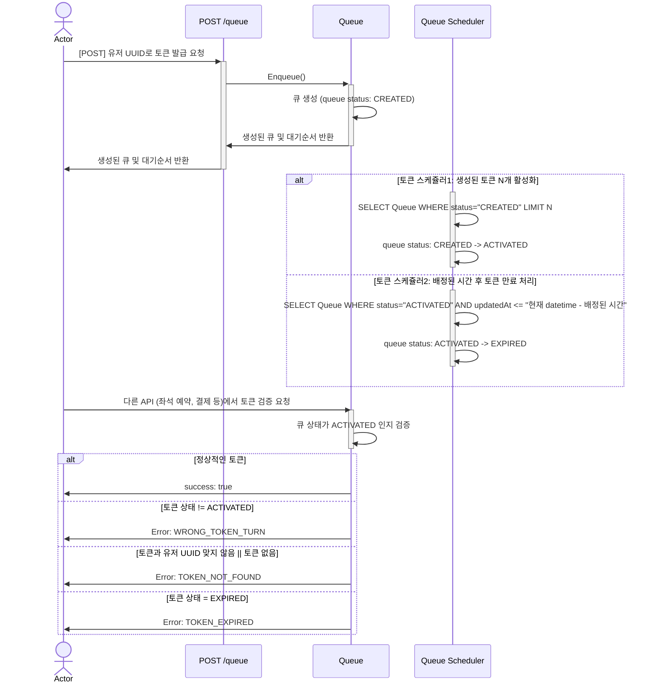
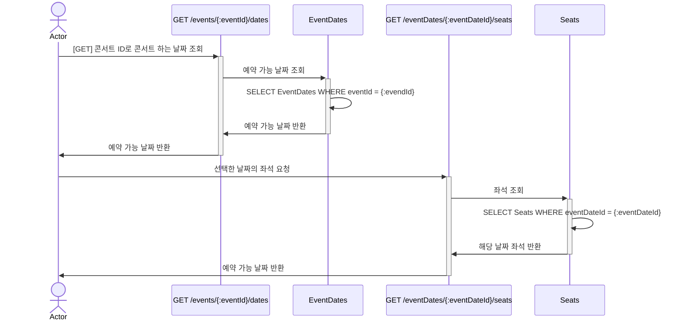
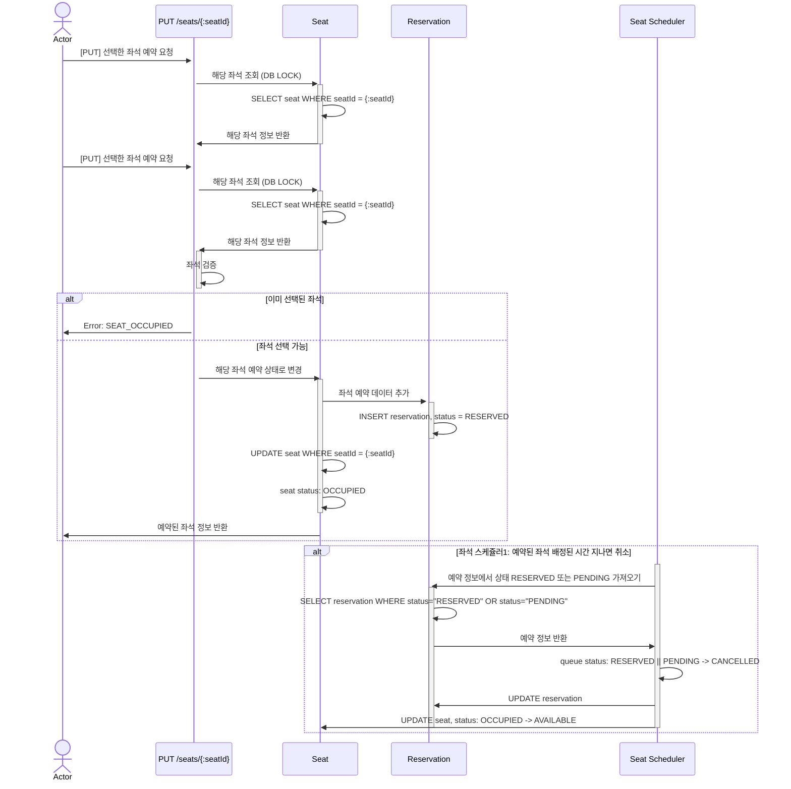
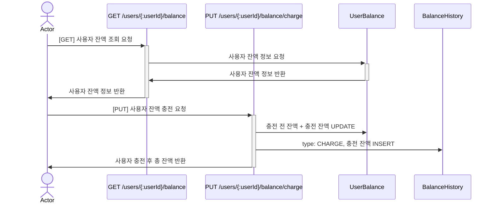
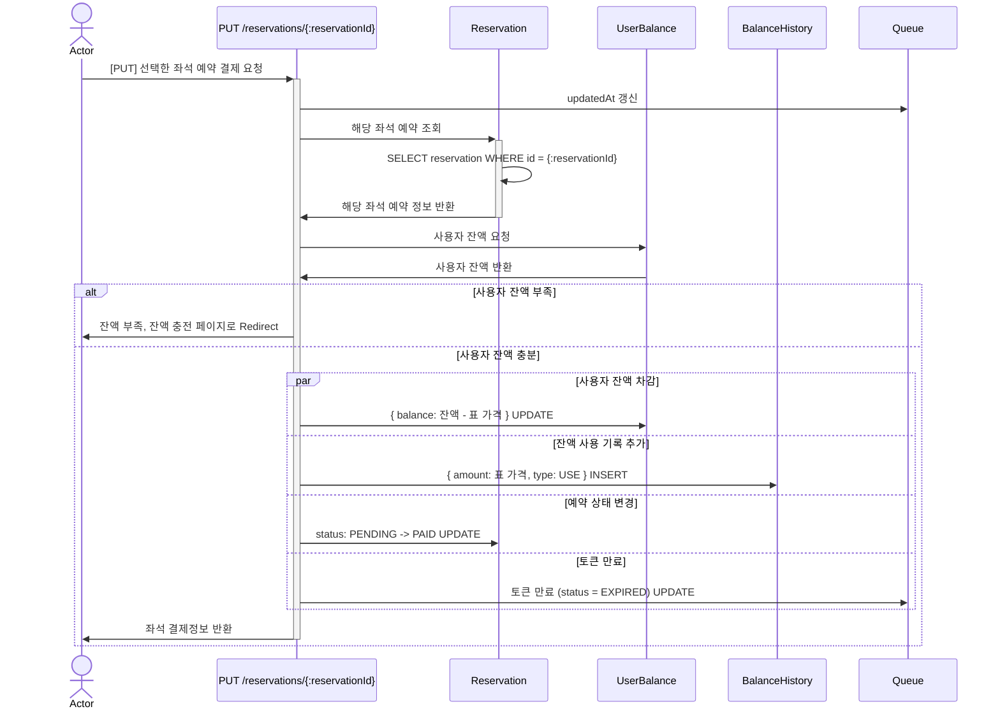

# 항해플러스 Chapter 2

## 목차

- [시나리오 요구사항 분석](#시나리오-요구사항-분석)
- [ERD 설계](#erd-설계)
- [API 명세서](#api-명세서)

## 시나리오 요구사항 분석

### **유저 대기열 토큰 기능**

---

- 서비스를 이용할 토큰을 발급받는 API를 작성합니다.
- 토큰은 유저의 UUID 와 해당 유저의 대기열을 관리할 수 있는 정보 ( 대기 순서 or 잔여 시간 등 ) 를 포함합니다.
- 이후 모든 API 는 위 토큰을 이용해 대기열 검증을 통과해야 이용 가능합니다.



### **예약 가능 날짜 / 좌석 API**

---

- 예약가능한 날짜와 해당 날짜의 좌석을 조회하는 API 를 각각 작성합니다.
- 예약 가능한 날짜 목록을 조회할 수 있습니다.
- 날짜 정보를 입력받아 예약가능한 좌석정보를 조회할 수 있습니다.
  > 좌석 정보는 1 ~ 50 까지의 좌석번호로 관리됩니다.



### **좌석 예약 요청 API**

---

- 날짜와 좌석 정보를 입력받아 좌석을 예약 처리하는 API 를 작성합니다.
- 좌석 예약과 동시에 해당 좌석은 그 유저에게 약 (예시 : 5분)간 임시 배정됩니다. ( 시간은 정책에 따라 자율적으로 정의합니다. )
- 만약 배정 시간 내에 결제가 완료되지 않는다면 좌석에 대한 임시 배정은 해제되어야 하며 만약 임시배정된 상태라면 다른 사용자는 예약할 수 없어야 한다.



### **잔액 충전 / 조회 API**

---

- 결제에 사용될 금액을 API 를 통해 충전하는 API 를 작성합니다.
- 사용자 식별자 및 충전할 금액을 받아 잔액을 충전합니다.
- 사용자 식별자를 통해 해당 사용자의 잔액을 조회합니다.



### **결제 API**

---

- 결제 처리하고 결제 내역을 생성하는 API 를 작성합니다.
- 결제가 완료되면 해당 좌석의 소유권을 유저에게 배정하고 대기열 토큰을 만료시킵니다.



---

## ERD 설계

| 테이블          | 용도                 | 설명                     |
| --------------- | -------------------- | ------------------------ |
| Event           | 공연                 | 기초 정보 (이름, 출연자) |
| Event Property  | 공연 속성            | 세부 정보                |
| Queue           | 대기열               |
| Seat            | 좌석                 | 특정 공연 날짜 좌석 정보 |
| Seat Property   | 좌석 속성            | 좌석 이름, 가격          |
| Reservation     | 예약                 | 좌석 예약 정보           |
| Payment         | 결제                 | 예약한 좌석 결제 정보    |
| User Balance    | 사용자 잔액          |
| Balance History | 잔액 충전, 사용 기록 |


## API 명세서

---

### API 목록

- [유저 대기열 토큰](#유저-대기열-토큰-api)
- [예약 가능 날짜 조회 API](#예약-가능-날짜-조회-api)
- [예약 가능 좌석 조회 API](#예약-가능-좌석-api)
- [좌석 예약 요청 API](#좌석-예약-요청-api)
- [잔액 조회 API](#잔액-조회-api)
- [잔액 충전 API](#잔액-충전-api)
- [결제 API](#결제-api)

---

### 유저 대기열 토큰 API

`POST /queue`

#### Request Body

| 이름   | 타입 | 내용      |
| ------ | ---- | --------- |
| userId | uuid | 사용자 ID |

```
- request body
{
  userId: 550e8400-e29b-41d4-a716-446655440000
}
```

#### Response Body

| 이름    | 타입    | 내용        |
| ------- | ------- | ----------- |
| eventId | integer | 콘서트의 ID |
| token   | string  | Bearer 토큰 |

```
- response
{
  success: true,
  data: {
   eventId: 1,
   token: Bearer ${token_value}
  }
}
```

---

### 예약 가능 날짜 조회 API

`GET /events/{:eventId}/dates`

#### Parameters

| 이름    | 타입          | 내용        |
| ------- | ------------- | ----------- |
| eventId | number string | 콘서트의 id |

#### Response Body

| 이름          | 타입    | 내용                |
| ------------- | ------- | ------------------- |
| eventId       | integer | 이벤트 ID           |
| eventDate     | date    | 공연 시작 날짜+시간 |
| bookStartDate | date    | 예약 가능 시작 날짜 |
| bookEndDate   | date    | 예약 종료 날짜      |
| seatCount     | integer | 잔여 좌석 갯수      |
| createdAt     | date    |                     |
| updatedAt     | date    |                     |
| deletedAt     | date    |                     |

```
- response
{
  success: true,
  data:  [
      {
        id: 1,
        eventId: 1,
        startDate: 2024-07-03 09:00:00
        seatCount: 50,
        createdAt:
        updatedAt:
        deletedAt:
      }, {...}
    ]
}
```

---

### 예약 가능 좌석 조회 API

`GET /events/properties/{:propertyId}/seats`

#### Parameters

| 이름       | 타입          | 내용                  |
| ---------- | ------------- | --------------------- |
| propertyId | number string | 콘서트 특정 날짜의 ID |

#### Response Body

| 이름                 | 타입                      | 내용                               |
| -------------------- | ------------------------- | ---------------------------------- |
| seatNumber           | integer                   | 좌석 번호                          |
| status               | "AVAILABLE" \| "OCCUPIED" | 예약 가능 \| 예약 또는 결제된 상태 |
| eventDateId          | integer                   | 콘서트 날짜 ID                     |
| seatProperty{}.id    | integer                   | 좌석 속성 ID                       |
| seatProperty{}.name  | string                    | 좌석 이름                          |
| seatProperty{}.price | integer                   | 좌석 가격                          |

```
- response
{
  success: true,
  data: {
   seat: [
      {
        id: 1,
        seatNumber: 1,
        status: available,
        eventDateId: 1,
        seatProperty: {
          id: 1,
          name: 스탠딩,
          price: 100000
        }
      }, {...}
    ]
  }
}
```

---

### 좌석 예약 요청 API

`POST /events/seats`

#### Request Body

| 이름   | 타입          | 내용             |
| ------ | ------------- | ---------------- |
| seatId | number string | 콘서트 좌석의 ID |
| userId | uuid          | 사용자 ID        |

```
- request body
{
  seatId: 1,
  userId: 550e8400-e29b-41d4-a716-446655440000
}
```

#### Response Body

| 이름            | 타입                                                           | 내용                  |
| --------------- | -------------------------------------------------------------- | --------------------- |
| seatId          | integer                                                        | 좌석 ID               |
| userId          | string                                                         | 사용자 ID             |
| status          | "RESERVED" \| "PENDING" \| "PAID" \| "CANCELLED" \| "REFUNDED" | 예약 상태             |
| eventId         | number                                                         | 공연 ID               |
| eventName       | integer                                                        | 공연 이름             |
| eventPropertyId | integer                                                        | 공연 속성 ID          |
| eventDate       | date                                                           | 공연 시작 날짜 + 시간 |
| price           | integer                                                        | 표 가격               |

```
- response
{
  success: true,
  data: {
    id: 1,
    seatId: 1,
    userId: ffd7a6d2-b742-4b7c-b7e4-a5e435435288,
    status: RESERVED,
    createdAt: 2024-07-03 14:34:19.282,
    updatedAt: 2024-07-03 14:34:19.282,
    deletedAt: 2024-07-03 14:34:19.282,
    eventId: 1,
    eventName: 공연 이름,
    eventPropertyId: 1,
    eventDate: 2024-07-03 14:34:19.282,
    price: 50000
  }
}
```

---

### 잔액 조회 API

`GET /users/{:userId}/balance`

#### Parameters

| 이름   | 타입 | 내용      |
| ------ | ---- | --------- |
| userId | uuid | 사용자 ID |

#### Response Body

| 이름    | 타입    | 내용                   |
| ------- | ------- | ---------------------- |
| id      | integer | User Balance 테이블 ID |
| userId  | string  | 사용자 ID              |
| balance | number  | 잔액 량                |

```
- response
{
  success: true,
  data: {
    id: 1,
    userId: ffd7a6d2-b742-4b7c-b7e4-a5e435435288,
    balance: 100000,
  }
}
```

---

### 잔액 충전 API

`PUT /users/{:userId}/balance/charge`

#### Parameters

| 이름   | 타입 | 내용      |
| ------ | ---- | --------- |
| userId | uuid | 사용자 ID |

#### Request Body

| 이름   | 타입    | 내용             |
| ------ | ------- | ---------------- |
| amount | integer | 충전 하려는 금액 |

```
- request body
{
  amount: 50000
}
```

#### Response Body

| 이름   | 타입                          | 내용                                     |
| ------ | ----------------------------- | ---------------------------------------- |
| id     | integer                       | Balance History 테이블 ID                |
| userId | string                        | 사용자 ID                                |
| type   | "CHARGE" \| "USE" \| "REFUND" | 충전 = CHARGE, 결제 = USE, 환불 = REFUND |
| amount | integer                       | 충전 된 금액                             |

```
- response
{
  success: true,
  data: {
      id: 1,
      userId: ffd7a6d2-b742-4b7c-b7e4-a5e435435288,
      type: CHARGE,
      amount: 50000
  }
}
```

---

### 결제 API

`PUT /events/reservations/{:reservationId}/pay`

#### Parameters

| 이름          | 타입 | 내용      |
| ------------- | ---- | --------- |
| reservationId | uuid | 사용자 ID |

#### Response Body

| 이름           | 타입                                                           | 내용                    |
| -------------- | -------------------------------------------------------------- | ----------------------- |
| id             | integer                                                        | Reservation 테이블 ID   |
| seatId         | integer                                                        | Seat 테이블 ID          |
| userId         | string                                                         | 사용자 ID               |
| status         | "RESERVED" \| "PENDING" \| "PAID" \| "CANCELLED" \| "REFUNDED" | 예약 상태               |
| eventId        | integer                                                        | 콘서트 ID               |
| eventName      | string                                                         | 콘서트 이름             |
| eventDateId    | integer                                                        | 콘서트 날짜 ID          |
| eventStartDate | datetime                                                       | 콘서트 시작 날짜 + 시간 |
| price          | integer                                                        | 표 가격                 |

```
- response
{
  success: true,
  data: {
      id: 1,
      seatId: 1,
      userId: ffd7a6d2-b742-4b7c-b7e4-a5e435435288,
      status: PAID,
      createdAt: 2024-07-03 14:34:19.282,
      updatedAt:2024-07-03 14:34:19.282,
      deletedAt: null,
      eventId: 1,
      eventName: 콘서트 이름,
      eventDateId: 1,
      eventStartDate: 2024-07-03 14:34:19.282,
      price: 50000
  }
}
```

---
